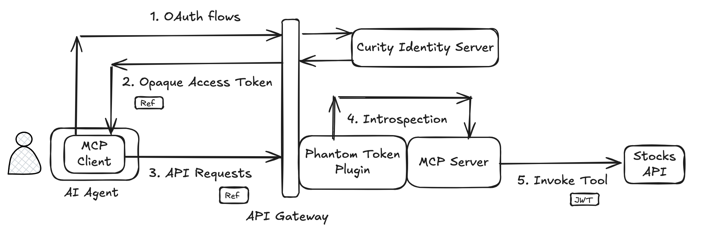

# MCP Authorization Secured API

How to expose an API using the draft [Model Content Protocol Authorization](https://modelcontextprotocol.io/specification/2025-03-26/basic/authorization) specification.\
The code example shows how to use an MCP server to expose existing OAuth-secured APIs to AI agents.

## Backend Endpoints

The backend includes an MCP server that provides a secure API entry point for AI agents that use MCP clients.\
The Curity Identity Server implements OAuth standards to enable the authorization from the specification.

| Endpoint | URL |
| -------- | --- |
| Stocks API | http://api.demo.example/stocks |
| Utility MCP Server | http://mcp.demo.example |
| Curity Identity Server Admin UI | http://admin.demo.example/admin |
| Curity Identity Server OAuth Metadata | http://login.demo.example/.well-known/oauth-authorization-server |
| Test Email Inbox | http://mail.demo.example |

Add the following entries to the `/etc/hosts` file to enable the use of these domains on your local computer.

```text
127.0.0.1 api.demo.example mcp.demo.example admin.demo.example login.demo.example mail.demo.example
```

## Run the End-to-End Flow

The deployed backend is then compliant with any standards-based MCP client that supports the specification.



### Install Prerequisites

First, install Docker and Node.js on your local computer.\
Also download a [Trial License](https://developer.curity.io/free-trial) for the Curity Identity Server from the Curity developer portal.\
Save the license to your desktop as a `license.json` file.

### Deploy the Backend

Run the following commands to deploy all backend components and provide OAuth-secured endpoints.

```bash
export LICENSE_FILE_PATH=~/Desktop/license.json
./build.sh
./deploy.sh
```

### Run the MCP Client

Run any MCP client that implements the behavior from the MCP draft authorization specification.\
You can run this repo's adapted version of the [TypeScript SDK Example MCP OAuth Client](https://github.com/modelcontextprotocol/typescript-sdk/blob/main/src/examples/client/simpleOAuthClient.ts).\
Use the following commands to run the MCP client.

```bash
cd mcp-client
npm install
npm start
```

The MCP client integrates with the MCP server and then runs a tool to access secure resources:

```text
🚀 Simple MCP OAuth Client
Connecting to: http://mcp.demo.example

🔗 Attempting to connect to http://mcp.demo.example...
🔐 Creating OAuth provider...
🔐 OAuth provider created
👤 Creating MCP client...
👤 Client created
🔐 Starting OAuth flow...
🚢 Creating transport with OAuth provider...
🚢 Transport created
🔌 Attempting connection (this will trigger OAuth redirect)...
Invalid WWW-Authenticate header format, expected 'Bearer'
📌 OAuth redirect handler called - opening browser
Opening browser to: http://login.demo.example/oauth/v2/oauth-authorize?response_type=code&client_id=07d66f9e-0d58-406e-80a9-5da570ae42a6&code_challenge=3gvRN6SPz8ML-cRnUtdyR1ec4f3Zf3dDUDKfUBTqQ58&code_challenge_method=S256&redirect_uri=http%3A%2F%2Flocalhost%3A8090%2Fcallback&scope=stocks%2Fread
🌐 Opening browser for authorization: http://login.demo.example/oauth/v2/oauth-authorize?response_type=code&client_id=07d66f9e-0d58-406e-80a9-5da570ae42a6&code_challenge=3gvRN6SPz8ML-cRnUtdyR1ec4f3Zf3dDUDKfUBTqQ58&code_challenge_method=S256&redirect_uri=http%3A%2F%2Flocalhost%3A8090%2Fcallback&scope=stocks%2Fread
Registered client data: {"redirect_uris":["http://localhost:8090/callback"],"token_endpoint_auth_method":"client_secret_post","grant_types":["authorization_code","refresh_token"],"response_types":["code"],"client_name":"Simple OAuth MCP Client","scope":"stocks/read","client_id":"07d66f9e-0d58-406e-80a9-5da570ae42a6","client_secret":"dzJmWfC7ZAXqQ1t9cusFEasEKf8RvK3XU5v1e_zHr-8","client_id_issued_at":1749642035,"client_secret_expires_at":0}
🔐 OAuth required - waiting for authorization...
OAuth callback server started on http://localhost:8090
📥 Received callback: /callback?iss=http%3A%2F%2Flogin.demo.example%2Foauth%2Fv2%2Foauth-anonymous&code=VTrM7o0KzCRIdE2bMm9MByosKocMa9w3
✅ Authorization code received: VTrM7o0KzC...
🔐 Authorization code received: VTrM7o0KzCRIdE2bMm9MByosKocMa9w3
🔌 Reconnecting with authenticated transport...
🚢 Creating transport with OAuth provider...
🚢 Transport created
🔌 Attempting connection (this will trigger OAuth redirect)...
✅ Connected successfully

🎯 Interactive MCP Client with OAuth
Commands:
  list - List available tools
  call <tool_name> [args] - Call a tool
  quit - Exit the client

mcp> call fetch-stock-prices

🔧 Tool 'fetch-stock-prices' result:
[{"id":"MSFT","name":"Microsoft Corporation","price":450.22},{"id":"AAPL","name":"Apple Inc","price":250.62},{"id":"INTC","name":"Intel Corp","price":21.07}]
```

### MCP Client Flow

The MCP client uses the following steps to get an access token and call the API:

- Resource server metadata download
- Authorization server metadata download
- Dynamic client registration
- User authentication
- User consent

Only MCP clients operated by the following administrator approved users can gain access to secured API data.\
The deployment includes these users, who must prove ownership of their corporate email to authenticate.\
Simulate that by entering the email and then a one-time password delivered to the test email inbox.

- john.doe@demo.example
- jane.test@demo.example


Users must then consent to granting the MCP client access to API data.\
The user is clearly informed about the level of data access being granted to the AI agent.


### Secure Access Tokens

The MCP client then receives the following token response:

```json
{
  "access_token": "_0XBPWQQ_d8ed4b47-7d85-455f-8d7e-03b08e84428b",
  "token_type": "bearer",
  "expires_in": 300,
  "scope": "stocks/read",
}
```

Notice the following access token characteristics returned to MCP clients (and therefore AI agents).\
These measures help to mitigate risks of releasing access tokens to AI agents:

- The MCP client is unable to read token claims and gain access to sensitive data intended for APIs.
- The token has a limited scope and read-only access.
- The token is short-lived, with a lifetime of 5 minutes.

The [Phantom Token Pattern](https://curity.io/resources/learn/phantom-token-pattern/) runs in the API gateway and delivers a JWT access token to the MCP server.\
The MCP server executes an MCP tool that calls the API, which receives the following JWT access token payload:

```json
{
  "jti": "2dc6cc38-d77f-4378-ba80-ba9d945141ff",
  "delegationId": "cd0c96fd-5fc3-4a92-a9fc-caf40e4e9b0c",
  "exp": 1749650409,
  "nbf": 1749650109,
  "scope": "stocks/read",
  "iss": "http://login.demo.example/oauth/v2/oauth-anonymous",
  "sub": "john.doe@demo.example",
  "aud": "8e636b87-6b22-4ca0-a602-a8ecacec1b84",
  "iat": 1749650109,
  "purpose": "access_token"
}
```

When granting access to AI agents the API must take special care to authorize access to resources.\
The authorization server can issue any required runtime values to the access token.\
The API must then authorize using [scopes](https://curity.io/resources/learn/scope-best-practices/) and [claims](https://curity.io/resources/learn/claims-best-practices/).

## Website Documentation

See the following resources to read further information on security concepts, threats and mitigations.\
The tutorial provides further details on the Curity Identity Server configuration and behaviors.

- [Securely Expose APIs to AI Agents](https://curity.io/resources/learn/securely-expose-apis-to-ai-agents/)
- [AI Agent Secure API Access Tutorial](https://curity.io/resources/learn/ai-agent-secure-api-access/)

## More Information

Please visit [curity.io](https://curity.io/) for more information about the Curity Identity Server.
