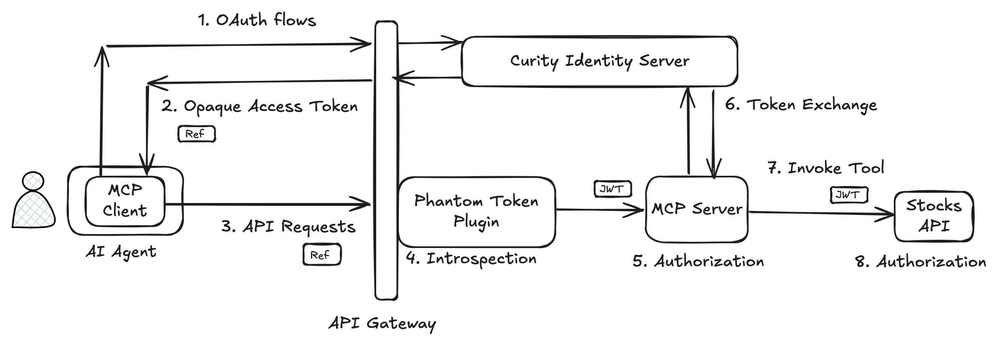
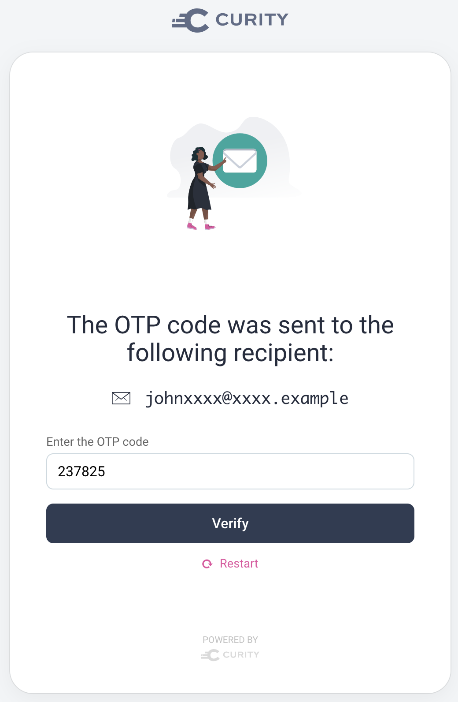
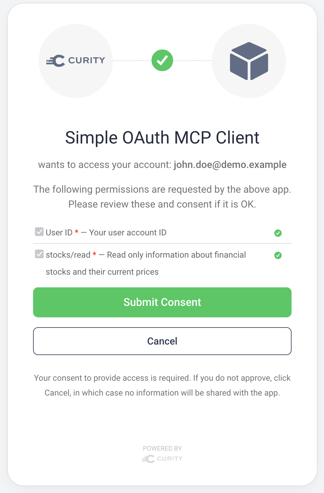

# MCP Authorization Secured API

This repository contains a code example to illustrate how organizations can expose APIs using the draft [Model Content Protocol Authorization](https://modelcontextprotocol.io/specification/2025-06-18/basic/authorization) specification.\
The code example shows how to use an MCP server to expose existing OAuth-secured APIs to AI agents.

## Overview

The example includes the following components:

* Example MCP client
* Stocks API that simulates an existing API
* MCP server that proxies requests to the API
* Authorization server (the Curity Identity Server) that issues access tokens
* API gateway that exposes public endpoints and includes a phantom token plugin (see [the phantom token approach](https://curity.io/resources/learn/phantom-token-pattern/))

The MCP client is typically part of an AI agent that users interact with using natural language. The AI agent selects and invokes the MCP client that, in turn, integrates with the MCP server. For simplicity, this example does not include an AI agent. However, it includes an example of an MCP client that you can run locally on your computer.

The end-to-end flow starts when an example MCP client calls a stateless MCP server.



The overall flow uses the following steps:

1. The MCP client runs OAuth flows to retrieve an access token.
2. The Curity Identity Server issues the MCP client a confidential (opaque) access token.
3. The MCP client sends the opaque access token to the MCP server.
4. The [phantom token plugin](https://github.com/curityio/nginx-lua-phantom-token-plugin) introspects the opaque access token and forwards a JWT access token to the MCP server.
5. The MCP server validates the JWT access token and checks that it has an audience of `http://mcp.demo.example/`.
6. Before calling the API the MCP server uses token exchange to change the token audience to`http://api.demo.example`.
7. The MCP server sends the exchanges access token to the stocks API.
8. The API validates the access token and uses its claims for authorization that protects business resources.

## Backend Endpoints

All external URLs in this code example are exposed using an instance of the Kong API gateway.\
The backend includes a utility MCP server that acts as an extension to the API gateway (that is, it only proxies requests to an existing API).\
MCP clients connect to the MCP server using a Streamable HTTP transport.

| Endpoint | URL | Description |
| -------- | --- | ----------- |
| MCP Server Entry Point | `http://mcp.demo.example` | Endpoint that the MCP client integrates with. |
| Stocks API | `http://api.demo.example/stocks` | The API entry point for non MCP clients. |
| Stocks API Resource Server Metadata | `http://mcp.demo.example/.well-known/oauth-protected-resource` | Used by the MCP client to discover the MCP server's authorization server. |
| Curity Identity Server OAuth Metadata | `http://login.demo.example/.well-known/oauth-authorization-server` | Used by the MCP client to discover the capabilities of the authorization server, e.g. authorization endpoint. |
| Curity Identity Server Admin UI | `http://admin.demo.example/admin` | Administration interface of the Curity Identity Server. |
| Curity Identity Server DCR | `http://login.demo.example/oauth/v2/oauth-registration` | Endpoint of the Curity Identity Server that enables the MCP client to automatically register, e.g. its redirect URI. |
| Curity Identity Server Authorization Endpoint | `http://login.demo.example/oauth/v2/oauth-authorize` | Endpoint discovered by the MCP client for starting the OAuth flow. |
| Curity Identity Server Token Endpoint | `http://login.demo.example/oauth/v2/oauth-token` | Endpoint from where the MCP client gets the access token at the end. |
| Curity Identity Server Login Interfaces | `http://login.demo.example/authn/authenticate/` | The base URL for authentication related user interaction. |
| Test Email Inbox | `http://mail.demo.example` | A mail server for testing purposes that lets you receive any emails that the Curity Identity Server sends. |

To enable the use of these domains on your local computer, add the following entries to the `/etc/hosts` file.

```text
127.0.0.1 api.demo.example mcp.demo.example admin.demo.example login.demo.example mail.demo.example
```

The Curity Identity Server implements OAuth standards (DCR, code flow) to enable the authorization as defined for MCP.\
You can log into the Admin UI with a username and password of `admin / Password1`.

## Run the End-to-End Flow

Typically you do not control the client or its code, and MCP clients make standards-based connections.\
The deployed backend in this code example uses standards-based security to enable many MCP clients to connect.

### Install Prerequisites

First, install Docker and Node.js 22 or later on your local computer.\
Get a [Trial License](https://developer.curity.io/free-trial) for the Curity Identity Server from the Curity developer portal.\
Save the license to your desktop as a `license.json` file.

### Deploy the Backend

Run the following commands to deploy all backend components and provide OAuth-secured endpoints. Adapt the path of the license file if necessary.

```bash
export LICENSE_FILE_PATH=~/Desktop/license.json
./build.sh
./deploy.sh
```

### Run the MCP Client

Run any MCP client that implements the behavior from the MCP draft authorization specification.\
You can use this repo's [Example MCP Client](mcp-client/README.md), which runs as a console application.\
Use the following commands to run the client.

```bash
cd mcp-client
npm install
npm start
```

The MCP client integrates with the MCP server to run OAuth flows and make a secured connection.\
The user can then run MCP tools to invoke API requests and access authorized resources.\
The example API returns some hard-coded fictional stock prices.

```text
🚀 Simple MCP OAuth Client
Connecting to: http://mcp.demo.example

🔗 Attempting to connect to http://mcp.demo.example...
🔐 Creating OAuth provider...
🔐 OAuth provider created
👤 Creating MCP client...
👤 Client created
🔐 Starting OAuth flow...
🚢 Creating transport with OAuth provider...
🚢 Transport created
🔌 Attempting connection (this will trigger OAuth redirect)...
📌 OAuth redirect handler called - opening browser
Opening browser to: http://login.demo.example/oauth/v2/oauth-authorize?response_type=code&client_id=24ae8cd9-3d44-434e-9506-1342d76eea5c&code_challenge=u1IP4WbEWQQbS04foPIsNdjE28v_-8yQefhrqr9zE9M&code_challenge_method=S256&redirect_uri=http%3A%2F%2Flocalhost%3A8090%2Fcallback&scope=stocks%2Fread
🌐 Opening browser for authorization: http://login.demo.example/oauth/v2/oauth-authorize?response_type=code&client_id=24ae8cd9-3d44-434e-9506-1342d76eea5c&code_challenge=u1IP4WbEWQQbS04foPIsNdjE28v_-8yQefhrqr9zE9M&code_challenge_method=S256&redirect_uri=http%3A%2F%2Flocalhost%3A8090%2Fcallback&scope=stocks%2Fread
🔐 OAuth required - waiting for authorization...
OAuth callback server started on http://localhost:8090
📥 Received callback: /callback?iss=http%3A%2F%2Flogin.demo.example%2Foauth%2Fv2%2Foauth-anonymous&code=dodc5hVzHJ3kAKmHgnGRyiyNgkVIVyNx
✅ Authorization code received: dodc5hVzHJ...
🔐 Authorization code received: dodc5hVzHJ3kAKmHgnGRyiyNgkVIVyNx
🔌 Reconnecting with authenticated transport...
🚢 Creating transport with OAuth provider...
🚢 Transport created
🔌 Attempting connection (this will trigger OAuth redirect)...
✅ Connected successfully

🎯 Interactive MCP Client with OAuth
Commands:
  list - List available tools
  call <tool_name> [args] - Call a tool
  quit - Exit the client

mcp> call fetch-stock-prices

🔧 Tool 'fetch-stock-prices' result:
[{"id":"COM1","name":Company 1","price":450.22},{"id":"COM2","name":"Company 2","price":250.62},{"id":"COM3","name":"Company 3","price":21.07}]
```

### MCP Client Flow

The MCP client uses the following steps to get an access token and call the API:

- Resource server metadata download.
- Authorization server metadata download.
- Dynamic client registration.
- User authentication.
- User consent.

Only MCP clients operated by the following administrator approved users can gain access to secured API data.\
These users must prove ownership of their corporate email to authenticate themselves.\
You can simulate that by entering one of the emails and typing a one-time password from the test email inbox.

- `john.doe@demo.example`
- `jane.test@demo.example`



Users must then consent to granting the MCP client access to API data.\
The user is informed about the level of data access that the AI agent requests.



### Secure Access Tokens

The MCP client then receives the following form of token response:

```json
{
  "access_token": "_0XBPWQQ_d8ed4b47-7d85-455f-8d7e-03b08e84428b",
  "token_type": "bearer",
  "expires_in": 900,
  "scope": "stocks/read",
}
```

Notice the following characteristics of the access token that gets returned to MCP clients (and therefore AI agents).\
These measures help to mitigate risks of releasing access tokens to AI agents:

- The MCP client is unable to read any access token claims.
- The MCP client's access token is short-lived with a limited scope.
- The MCP client does not receive a refresh token.

The [Kong API gateway routes](apigateway/kong.yml) expose both the MCP server and API endpoints.\
The MCP server receives a scoped JWT access token with a payload similar to the following.\
The access token is only accepted at MCP entry points and not at other API endpoints.

```json
{
  "jti": "2dc6cc38-d77f-4378-ba80-ba9d945141ff",
  "delegationId": "cd0c96fd-5fc3-4a92-a9fc-caf40e4e9b0c",
  "exp": 1749650409,
  "nbf": 1749650109,
  "scope": "stocks/read",
  "iss": "http://login.demo.example/oauth/v2/oauth-anonymous",
  "sub": "john.doe@demo.example",
  "aud": ["http://mcp.demo.example/"],
  "iat": 1749650109,
  "purpose": "access_token"
}
```

The MCP server uses token exchange to update the access token's audience and calls the stocks API.\
The Curity Identity Server could also issue any required custom claims to the access token.\
APIs must then authorize to protect data using [scopes](https://curity.io/resources/learn/scope-best-practices/) and [claims](https://curity.io/resources/learn/claims-best-practices/).

## Website Documentation

See the following resources to read further information on security concepts, threats and mitigations.\
The tutorial provides further details on the code example's behaviors.

- [Design MCP Authorization for APIs](https://curity.io/resources/learn/design-mcp-authorization-apis/)
- [Implementing MCP Server Authorization for APIs](https://curity.io/resources/learn/implementing-mcp-authorization-apis/)

## More Information

Please visit [curity.io](https://curity.io/) for more information about the Curity Identity Server.
