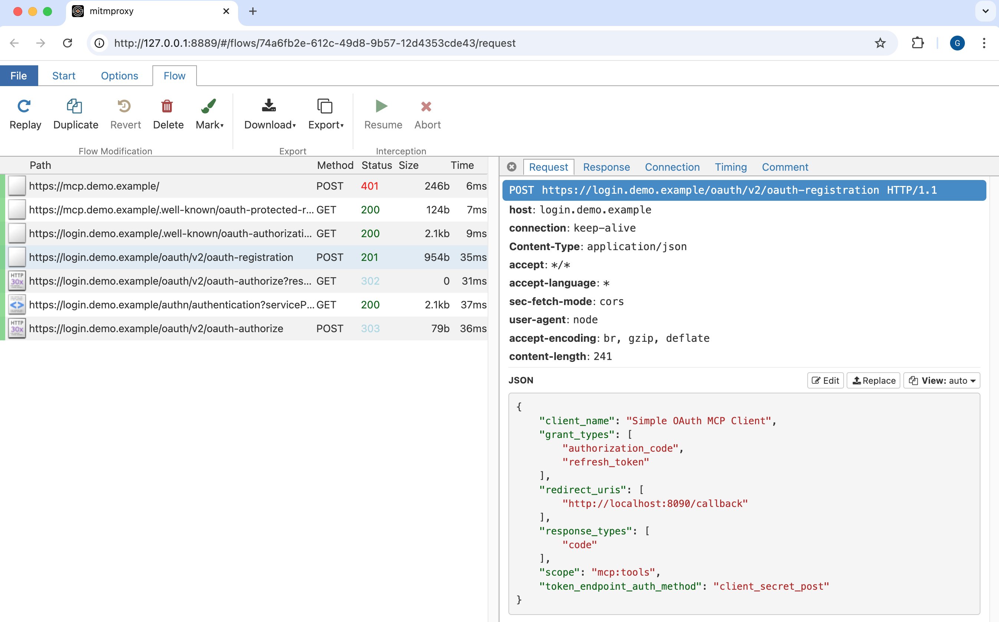

# Tracing OAuth and MCP Messages

To trace MCP and OAuth messages, an HTTP proxy tool like [mitmproxy](https://mitmproxy.org/) can be very useful.\
The proxy can capture all details of both browser and non-browser requests and visualize them.



## Run mitmproxy

Follow the [installation instructions](https://docs.mitmproxy.org/stable/overview/installation/).\
Then create an `init.py` script to restrict request capturing to the example deployment's endpoints:

```python
from mitmproxy import ctx

def load(loader):
    ctx.options.view_filter = "~d demo.example"
```

Then run a command such as the following and open the browser at `http://localhost:8889`:

```bash
mitmweb -p 8888 --web-port 8889 --ssl-insecure --script init.py
```

## Capture API Gateway Requests

If you can't get an HTTP proxy to work, another option is to log API gateway details.\
You can add the following built-in plugin configuration to one or more routes in the `kong.yml` file.

```yaml
plugins:
- name: file-log
    config:
      path: /dev/stdout
- name: pre-function
  config:
    access:
    - kong.log.set_serialize_value("request.body", kong.request.get_raw_body())
    body_filter:
    - kong.log.set_serialize_value("response.body", kong.response.get_raw_body())
```

## OAuth Messages

Once you have a setup to capture messages you can see the details of the OAuth flow.

## Dynamic Client Creation

The MCP client sends a DCR request of the following form:

```json
{
    "client_name": "Claude Desktop",
    "client_uri": "https://github.com/modelcontextprotocol/mcp-cli",
    "grant_types": [
        "authorization_code",
        "refresh_token"
    ],
    "redirect_uris": [
        "http://localhost:53069/callback"
    ],
    "response_types": [
        "code"
    ],
    "scope": "stocks/read",
    "token_endpoint_auth_method": "none"
}
```

The Curity Identity Server's example configuration grants the client access to the low-privilege scope:

```json
{
    "access_token_ttl": 900,
    "audiences": [
        "https://mcp.demo.example/"
    ],
    "client_id": "15d64f90-5df1-4ab8-ae48-af0aa2e6d562",
    "client_id_issued_at": 1759825565,
    "client_name": "Claude Desktop",
    "client_secret": "lYo5fRR4mMn9bTxIbigv9ZCn1lT6BEKuHA3zZpOxR0s",
    "client_secret_expires_at": 0,
    "default_acr_values": [
        "urn:se:curity:authentication:email:email"
    ],
    "grant_types": [
        "authorization_code"
    ],
    "post_logout_redirect_uris": [],
    "redirect_uris": [
        "http://localhost:65343/callback"
    ],
    "require_proof_key": true,
    "requires_consent": true,
    "response_types": [
        "code"
    ],
    "scope": "stocks/read",
    "subject_type": "public",
    "token_endpoint_auth_method": "client_secret_basic",
    "token_endpoint_auth_methods": [
        "client_secret_basic",
        "client_secret_post"
    ]
}
```

Some clients indicates that they are a public client with `token_endpoint_auth_method=none`.\
The Curity Identity Server overrides this and returns a client secret.\
Each distinct user gets a different client secret with which to retrieve access tokens.

## Login and Token Flow

The client sends the following form of front channel request:

```text
https://login.demo.example/oauth/v2/oauth-authorize
    ?response_type=code
    &client_id=15d64f90-5df1-4ab8-ae48-af0aa2e6d562
    &scope=stocks/read
    &code_challenge=smTSjLwxtHVdi8_jRkJkeygwYEKPBcJ-PEeNWr_LrUI
    &code_challenge_method=S256
    &redirect_uri=http://localhost:53069/callback
    &state=iGtjhJO4i-0Bxxb6q1A4lkcx6antjlXRRhPzTan81Dg
    &resource=https://mcp.demo.example/
```

The client then sends the following form of back channel request:

```text

grant_type:    authorization_code
code:          ekgBhvoQAByoT5520ZRQhLtGa2KU9tTd
code_verifier: 4F.adBoQzg1s3pFCaOA00Dv4bb6B0D4sll9glHPHo4M
redirect_uri:  http://localhost:53069/callback
client_id:     15d64f90-5df1-4ab8-ae48-af0aa2e6d562
client_secret: lYo5fRR4mMn9bTxIbigv9ZCn1lT6BEKuHA3zZpOxR0s-BGdZg
scope:         stocks/read
resource:      https://mcp.demo.example/
```

The Curity Identity Server then issues an access token with the low-privilege scope.\
The end result is that the MCP client operates with API privileges that you fully control.

```json
{
    "access_token": "_0XBPWQQ_5d049ae7-01d7-4f48-bc6b-8cc833d249e9",
    "expires_in": 900,
    "scope": "stocks/read",
    "token_type": "bearer"
}
```
