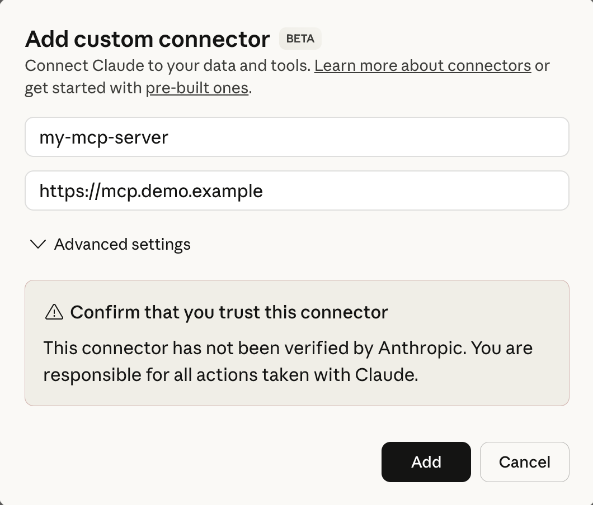

# Claude Desktop

The [Desktop v Web Connectors](https://support.claude.com/en/articles/11725091-when-to-use-desktop-and-web-connectors) article explains the two Claude user-facing apps:

- You can use the free Claude Desktop and run a desktop connector flow for the example deployment.\
  This keeps the data from your MCP server local.

- Alternatively, you can also use a web connector flow with a [paid account](https://claude.com/pricing).\
  This exposes the data from your MCP server to a shared platform.

## Use a Desktop Connector

In Claude Desktop, select `Settings / Developer` and then the `Edit Config` option.\
Provide a configuration file with the following settings and then restart Claude Desktop.\
Make sure you use the correct certificate file path for your computer:

```json
{
  "mcpServers": {
    "curity-demo": {
      "command": "npx",
      "args": ["mcp-remote", "https://mcp.demo.example", "--static-oauth-client-metadata", "{ \"client_name\": \"Claude (curity-demo)\", \"scope\": \"stocks/read\" }"],
      "env": {
		"NODE_EXTRA_CA_CERTS": "/Users/MYUSER/dev/mcp-authorization-secured-api/apigateway/certs/example.ca.crt"
      }
    }
  }
}
```

The [MCP Remote](https://github.com/geelen/mcp-remote) library makes the underlying OAuth and MCP requests.\
A static scope is configured until the mcp-remote library implements the [Scope Selection Strategy](https://modelcontextprotocol.io/specification/draft/basic/authorization#scope-selection-strategy).

## Usage

You can then just ask Claude Desktop a natural language question.\
The client triggers the OAuth flow from this repository's main [README](../../README.md).


After login, Claude stores its dynamic client information and tokens.\
You can view details in the `~/.mcp-auth` folder or delete the folder to reset Claude's state.

## Troubleshoot

If you need to troubleshoot, see the file for the MCP server in the logs folder:


## Capture OAuth and MCP Requests

The [OAuth and MCP Requests](../OAUTH-MCP-MESSAGES.md) summary explains the OAuth and MCP messages.

## Use a Web Connector

You can configure a web connector by logging in to `https://claude.ai` and entering an internet MCP server URL.\
The Claude web backend then sends a DCR request of the following form:

```json
{
    "client_name": "Claude",
    "client_uri": "https://claude.ai/api/mcp/auth_callback",
    "grant_types": [
        "authorization_code",
        "refresh_token"
    ],
    "redirect_uris": [
        "https://claude.ai/api/mcp/auth_callback"
    ],
    "response_types": [
        "code"
    ],
    "scope": "address phone email openid profile stocks/read",
    "token_endpoint_auth_method": "client_secret_post"
}
```

The following settings improve the security of OAuth flows:

- The Claude backend uses a protected client secret that is never revealed to the browser.
- Claude receives the authorization code on a secure redirect URI, to prevent access from other websites.

## Static Clients

Depending on your Claude plan, you may be able to use a static client:



A static client in the Curity Identity Server could use the following settings:

```xml
<config xmlns="http://tail-f.com/ns/config/1.0">
  <profiles xmlns="https://curity.se/ns/conf/base">
    <profile>
      <id>token-service</id>
      <type xmlns:as="https://curity.se/ns/conf/profile/oauth">as:oauth-service</type>
        <settings>
          <authorization-server xmlns="https://curity.se/ns/conf/profile/oauth">
            <client-store>
              <config-backed>
                <client>
                  <id>claude-client</id>
                  <secret>my-client-secret</secret>
                  <redirect-uris>https://claude.ai/api/mcp/auth_callback</redirect-uris>
                  <audience>claude-client</audience>
                  <audience>https://mcp.demo.example/</audience>
                  <scope>address</scope>
                  <scope>openid</scope>
                  <scope>email</scope>
                  <scope>phone</scope>
                  <scope>stocks/read</scope>
                  <scope>profile</scope>
                  <user-authentication>
                    <allowed-authenticators>email</allowed-authenticators>
                  </user-authentication>
                  <capabilities>
                    <code>
                    </code>
                  </capabilities>
                  <validate-port-on-loopback-interfaces>true</validate-port-on-loopback-interfaces>
                </client>
              </config-backed>
            </client-store>
          </authorization-server>
        </settings>
    </profile>
  </profiles>
</config>
```

In some enterprise use cases that may provide more convenient options:

- An enterprise administrator might be able to register a single static client for all employees.
- The administrator might then simplify the deployment by disabling the use of dynamic clients.
