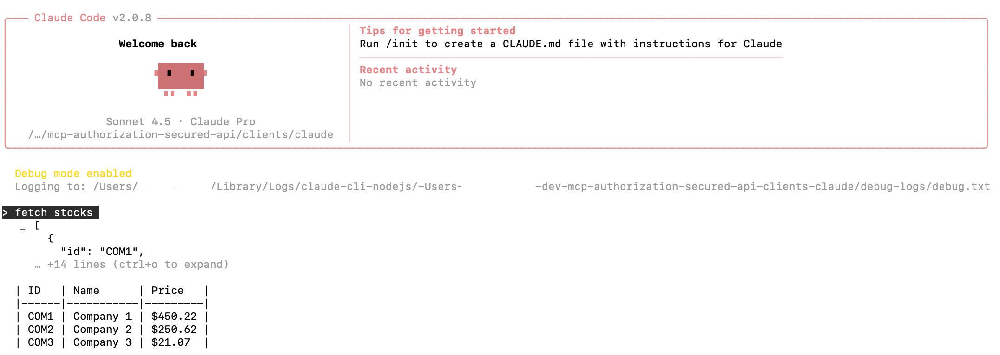

# Claude

To connect to the MCP server using Claude you currently need a [paid account](https://claude.com/pricing).\
For example, you could get started with a `Pro` individual account.

## Install Claude Code

Run the installation command:

```bash
npm install -g @anthropic-ai/claude-code
```

## Use Claude Code

Open a terminal in this folder and run Claude against the deployed MCP Server:

```bash
./run.sh
```

The output will indicate the path to a log file.\
Tail the log file in another terminal window in case you need to troubleshoot:

```bash
tail -f ~/Library/Logs/claude-cli-nodejs/-Users-MYUSER-dev-claude/debug-logs/debug.txt
```

Claude Code then runs the MCP authorization flow and gets connected.\
You can then ask Claude a question related to stocks and it calls the MCP server:



## Use the MCP Server with Claude Desktop

In Claude Desktop, select `Settings / Developer` and then the `Edit Config` option.

```json
{
  "mcpServers": {
    "curity-demo": {
      "command": "npx",
      "args": ["mcp-remote", "https://mcp.demo.example"],
      "env": {
        "NODE_EXTRA_CA_CERTS": "/Users/MYUSER/Desktop/example.ca.crt"
      }
    }
  }
}
```

At the time of writing there may be an [open issue](https://github.com/anthropics/claude-code/issues/5826).
