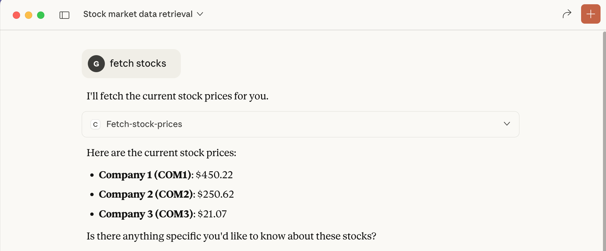
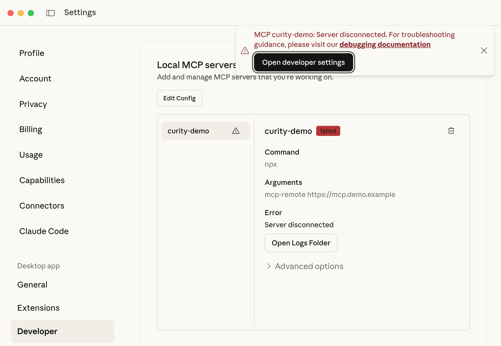

# Claude Desktop

Claude Desktop runs as a local console application.\
To use Claude Desktop you need a [paid account](https://claude.com/pricing).\
For example, you could get started with a `Pro` individual account.

## Configure Claude Desktop

In Claude Desktop, select `Settings / Developer` and then the `Edit Config` option.\
Provide the URL to the MCP server and the full path to the development root certificate.\
Then restart Claude Desktop:

```json
{
  "mcpServers": {
    "curity-demo": {
      "command": "npx",
      "args": ["mcp-remote", "https://mcp.demo.example"],
      "env": {
        "NODE_EXTRA_CA_CERTS": "/Users/MYUSER/dev/mcp-authorization-secured-api/example.ca.crt"
      }
    }
  }
}
```

## Usage

You can then just ask Claude Desktop a natural language question.\
The client triggers the OAuth flow from this repository's main [README](../../README.md).\



## Troubleshoot

If you need to troubleshoot, see the file for the MCP server in the logs folder:


