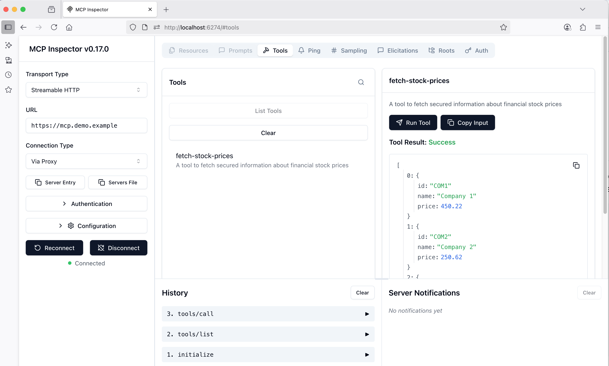

# MCP Inspector OAuth Client

The MCP inspector runs as a local web application.

## Usage

Execute the following script from the current folder.\
The code clones the code for the MCP inspector and runs its web client:

```bash
./run.sh
```

## Client Behavior

Wait for a few seconds and the MCP inspector opens in the browser.\
Configure the following properties in the browser frontend:

- Transport Type = Streamable HTTP
- URL: `https://mcp.demo.example`

Then click the `Connect` button and run the authentication flow.\
The client triggers the OAuth flow from this repository's main [README](../../README.md).\
The client then provides a web user interface and the user can invoke API operations as MCP tools:




