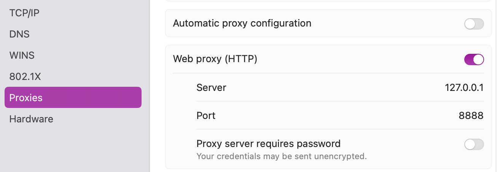

# TypeScript SDK OAuth Client

This is a copy of the [TypeScript SDK Example MCP OAuth Client](https://github.com/modelcontextprotocol/typescript-sdk/blob/main/src/examples/client/simpleOAuthClient.ts) with minor changes.

## Usage

The TypeScript SDK client is a simple console application which you first prepare:

```bash
cd mcp-client
npm install
```

Then run the console app with the following commands:

```bash
npm start
```

The MCP client integrates with the MCP server to run OAuth flows and make a secured connection.\
The user can then run MCP tools to invoke API requests and access authorized resources.\
The example API returns some hard-coded fictional stock prices.

```text
🚀 Simple MCP OAuth Client
Connecting to: https://mcp.demo.example

🔗 Attempting to connect to https://mcp.demo.example...
🔐 Creating OAuth provider...
🔐 OAuth provider created
👤 Creating MCP client...
👤 Client created
🔐 Starting OAuth flow...
🚢 Creating transport with OAuth provider...
🚢 Transport created
🔌 Attempting connection (this will trigger OAuth redirect)...
📌 OAuth redirect handler called - opening browser
Opening browser to: https://login.demo.example/oauth/v2/oauth-authorize?response_type=code&client_id=24ae8cd9-3d44-434e-9506-1342d76eea5c&code_challenge=u1IP4WbEWQQbS04foPIsNdjE28v_-8yQefhrqr9zE9M&code_challenge_method=S256&redirect_uri=http%3A%2F%2Flocalhost%3A8090%2Fcallback&scope=stocks%2Fread
🌐 Opening browser for authorization: https://login.demo.example/oauth/v2/oauth-authorize?response_type=code&client_id=24ae8cd9-3d44-434e-9506-1342d76eea5c&code_challenge=u1IP4WbEWQQbS04foPIsNdjE28v_-8yQefhrqr9zE9M&code_challenge_method=S256&redirect_uri=http%3A%2F%2Flocalhost%3A8090%2Fcallback&scope=stocks%2Fread
🔐 OAuth required - waiting for authorization...
OAuth callback server started on http://localhost:8090
📥 Received callback: /callback?iss=http%3A%2F%2Flogin.demo.example%2Foauth%2Fv2%2Foauth-anonymous&code=dodc5hVzHJ3kAKmHgnGRyiyNgkVIVyNx
✅ Authorization code received: dodc5hVzHJ...
🔐 Authorization code received: dodc5hVzHJ3kAKmHgnGRyiyNgkVIVyNx
🔌 Reconnecting with authenticated transport...
🚢 Creating transport with OAuth provider...
🚢 Transport created
🔌 Attempting connection (this will trigger OAuth redirect)...
✅ Connected successfully

🎯 Interactive MCP Client with OAuth
Commands:
  list - List available tools
  call <tool_name> [args] - Call a tool
  quit - Exit the client

mcp> call fetch-stock-prices

🔧 Tool 'fetch-stock-prices' result:
[{"id":"COM1","name":Company 1","price":450.22},{"id":"COM2","name":"Company 2","price":250.62},{"id":"COM3","name":"Company 3","price":21.07}]
```

## Code Edits

This repo's copy of the example client contains slightly edited code to set the initial scope:

```typescript
const clientMetadata: OAuthClientMetadata = {
    client_name: 'Simple OAuth MCP Client',
    redirect_uris: [CALLBACK_URL],
    grant_types: ['authorization_code'],
    response_types: ['code'],
    token_endpoint_auth_method: 'client_secret_post',
    scope: 'stocks/read'
};
```

It also contains the following edits to capture MCP, OAuth and API requests in an HTTP proxy tool:

```typescript
import { setGlobalDispatcher, ProxyAgent } from 'undici';

if (process.env.http_proxy) {
  const dispatcher = new ProxyAgent({uri: new URL(process.env.http_proxy).toString() });
  setGlobalDispatcher(dispatcher);
}
```

## View MCP Messages with an HTTP Proxy

The following screenshot shows a streamable HTTP request when an MCP tool is called.


You first need to install an HTTP proxy tool like [mitmproxy](https://mitmproxy.org/).\
Save the following small script as `init.py` to limit traffic to the code example's URLs:

```python
from mitmproxy import ctx

def load(loader):
    ctx.options.view_filter = "~d demo.example"
```

Run the proxy with a command like this, which will open the browser at `http://localhost:8889`.

```bash
mitmweb -p 8888 --web-port 8889 --ssl-insecure --script init.py
```

Then configure the HTTP proxy against the local computer's network connection:



You can run the MCP client with the following commands to route messages via the HTTP proxy tool.

```bash
export http_proxy='http://127.0.0.1:8888'
npm start
```
