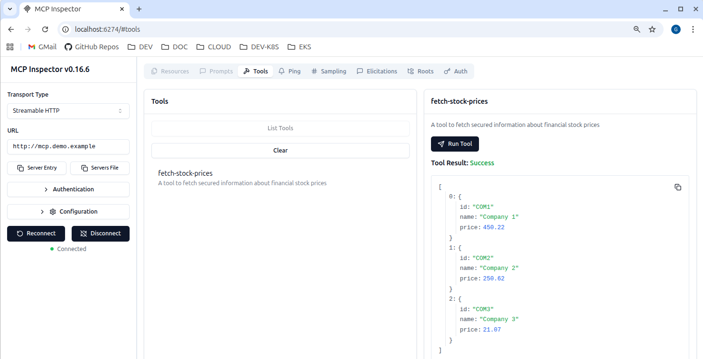

# Use the MCP Inspector

The MCP inspector can be run as a client to the example backend deployment:



## Prepare the MCP Inspector

Clone the MCP inspector repo and install its dependencies:

```bash
git clone https://github.com/modelcontextprotocol/inspector
cd inspector
npm install
```

There are currently a couple of incompatibilities which you can manually resolve.\
Edit the `client/src/lib/auth.ts` source file and make edits to match the following code:

```typescript
get clientMetadata(): OAuthClientMetadata {
    return {
      redirect_uris: [this.redirectUrl],
      token_endpoint_auth_method: "client_secret_post",
      grant_types: ["authorization_code"],
      response_types: ["code"],
      client_name: "MCP Inspector",
      client_uri: "http://localhost:6274",
      scope: 'stocks/read',
    };
}

saveClientInformation(clientInformation: OAuthClientInformation) {
    saveClientInformationToSessionStorage({
        serverUrl: this.serverUrl,
        clientInformation: clientInformation,
        isPreregistered: false,
    });
}
```

## Run the MCP Inspector

Run the following command to run the client:

```bash
npm run dev
```

Wait for the MCP inspector and then open the MCP inspector URL in the browser:

```text
Starting MCP inspector in development mode...
⚙️ Proxy server listening on localhost:6277
🔑 Session token: eb476f416efa69a0c2c346b264079c9540d801592aa3c97916c0ddceb2e003ac
   Use this token to authenticate requests or set DANGEROUSLY_OMIT_AUTH=true to disable auth

  VITE v6.3.5  ready in 108 ms

  ➜  Local:   http://localhost:6274/

🚀 MCP Inspector is up and running at:
   http://localhost:6274/?MCP_PROXY_AUTH_TOKEN=eb476f416efa69a0c2c346b264079c9540d801592aa3c97916c0ddceb2e003ac

🌐 Opening browser...
```

## Connect to the MCP Server

Set these properties in the browser frontend:

- Transport Type = Streamable HTTP
- URL: `http://mcp.demo.example`

Open the proxy URL in the browser and click the `Connect` button.\
Then re-run the authentication flow.
